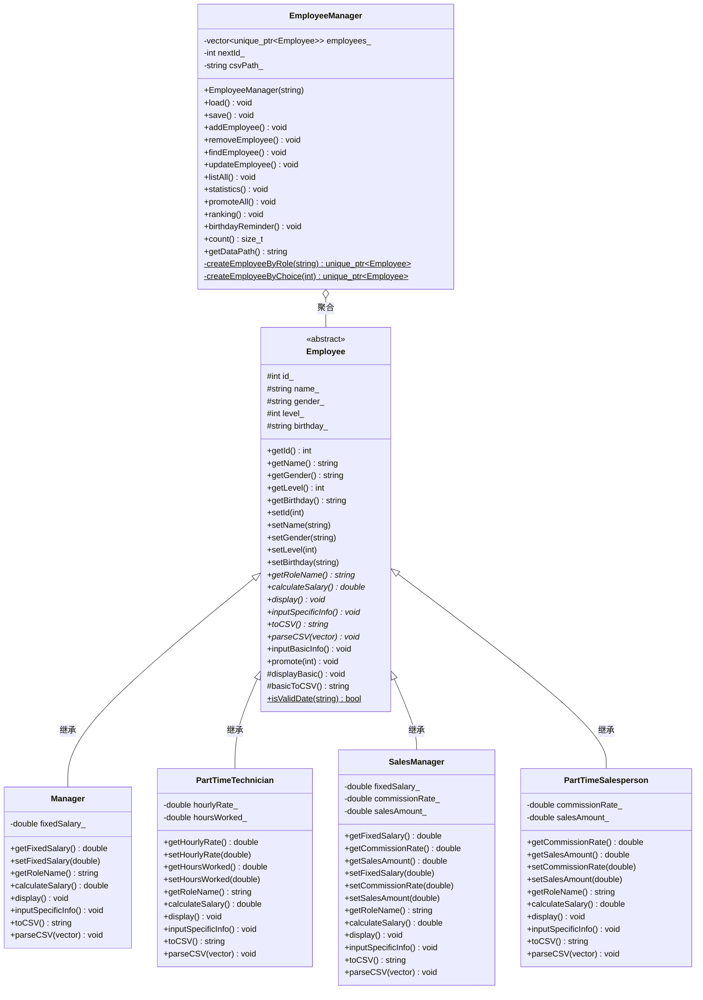
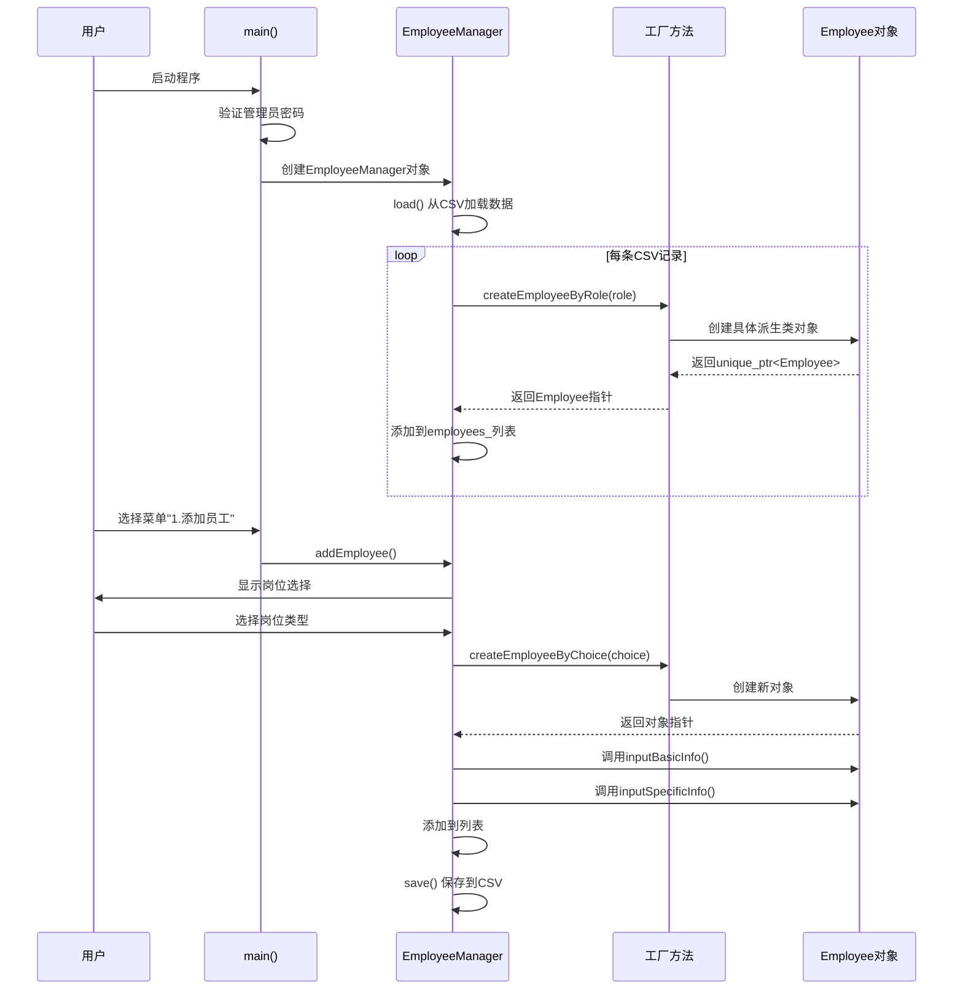
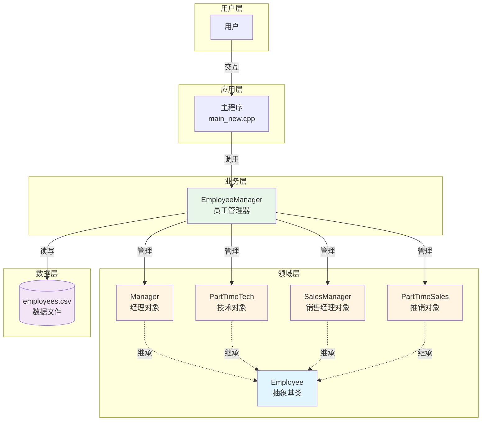
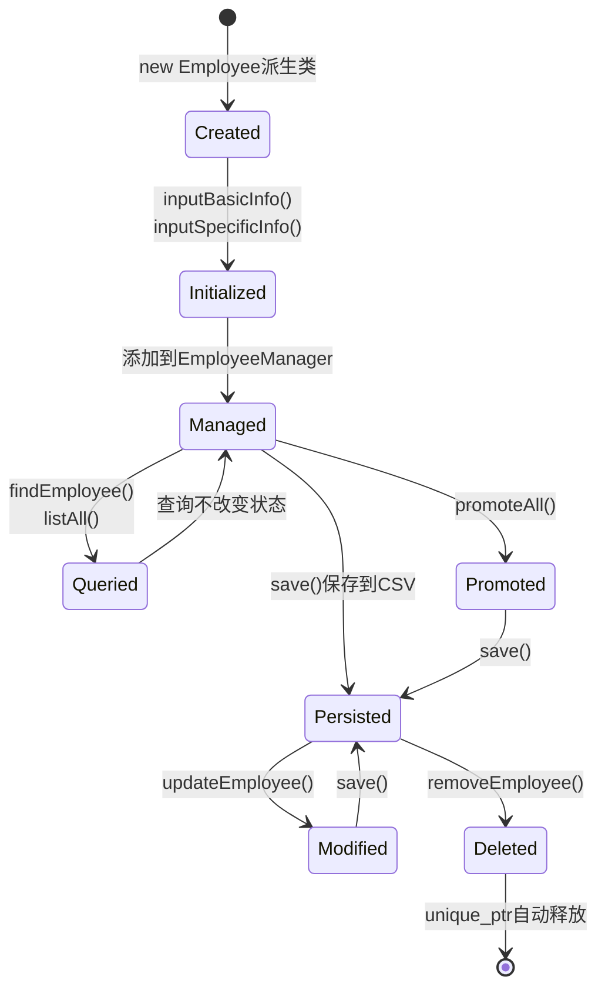
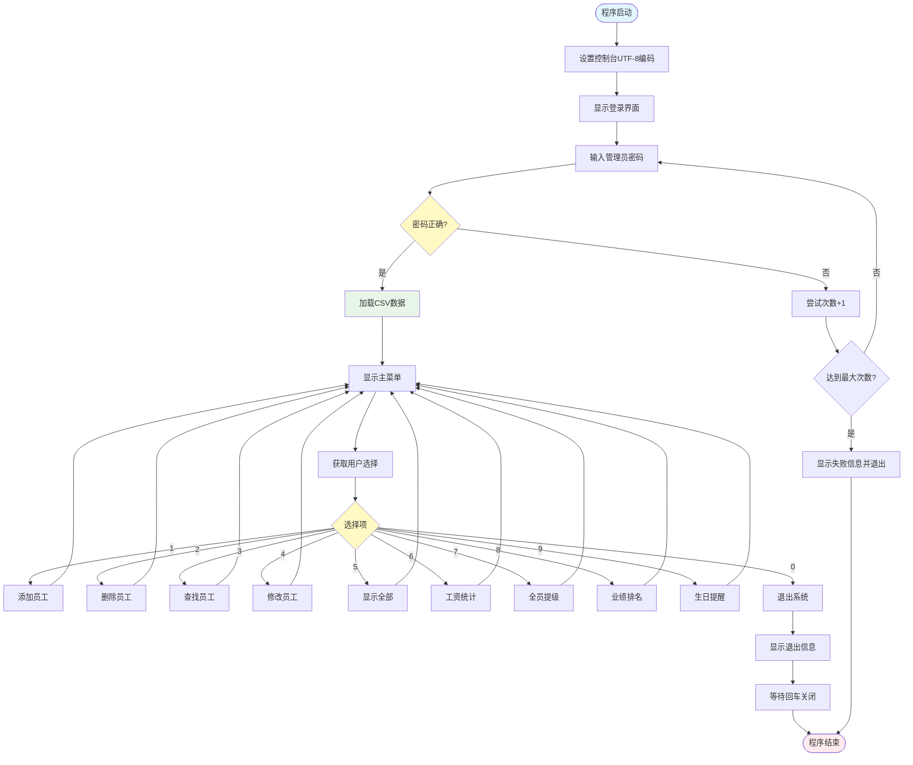
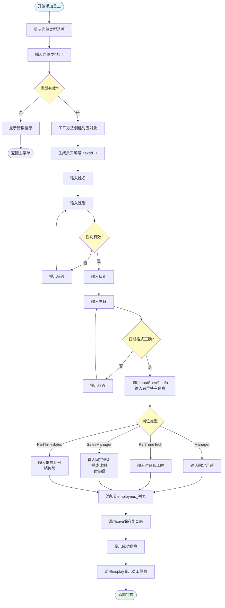

# 企业人力管理系统 - 系统设计文档

## 文档版本信息
- **版本号**: v1.0
- **编写日期**: 2025年12月18日
- **项目名称**: 企业人力管理系统 (Employee Management System)
- **开发语言**: C++17
- **设计模式**: 面向对象程序设计 (OOP)

---

## 一、系统概述

### 1.1 项目背景
本系统是基于面向对象程序设计思想开发的企业人力资源管理系统，用于管理企业的四类人员：经理、兼职技术人员、销售经理和兼职推销员。系统采用CSV文件持久化数据，通过控制台界面提供交互式操作。

### 1.2 系统目标
- 实现员工档案信息的完整管理（增删改查）
- 自动计算不同岗位的月薪
- 统计公司整体薪资数据与各类占比
- 支持员工级别提升与业绩排名
- 提供生日提醒、管理员登录等扩展功能

### 1.3 技术架构
```
┌─────────────────────────────────────────┐
│         用户交互层 (UI Layer)            │
│     main_new.cpp - 控制台菜单界面        │
└──────────────────┬──────────────────────┘
                   │
┌──────────────────▼──────────────────────┐
│       业务逻辑层 (Business Layer)        │
│    EmployeeManager - 员工管理类         │
│    • CRUD操作  • 统计分析  • 持久化     │
└──────────────────┬──────────────────────┘
                   │
┌──────────────────▼──────────────────────┐
│      领域模型层 (Domain Layer)           │
│         Employee (抽象基类)              │
│     ┌────┬──────┬──────┬──────┐         │
│     │    │      │      │      │         │
│  Manager PartTime Sales PartTime        │
│         Technician Manager Salesperson  │
└──────────────────┬──────────────────────┘
                   │
┌──────────────────▼──────────────────────┐
│       数据持久层 (Data Layer)            │
│      data/employees.csv (CSV文件)       │
└─────────────────────────────────────────┘
```

---

## 二、功能模块设计

### 2.1 核心功能模块

#### 2.1.1 员工信息管理模块
**模块职责**: 负责员工基本信息的全生命周期管理

| 功能编号 | 功能名称 | 功能描述 | 实现类/方法 |
|---------|---------|---------|------------|
| F01 | 添加员工 | 从控制台读取员工信息，自动生成编号，保存到文件 | `EmployeeManager::addEmployee()` |
| F02 | 删除员工 | 根据编号删除指定员工记录 | `EmployeeManager::removeEmployee()` |
| F03 | 查找员工 | 按姓名或编号检索员工信息 | `EmployeeManager::findEmployee()` |
| F04 | 修改员工 | 更新员工的基本信息和岗位信息 | `EmployeeManager::updateEmployee()` |
| F05 | 显示全部 | 列出所有员工的详细信息 | `EmployeeManager::listAll()` |

#### 2.1.2 薪资计算与统计模块
**模块职责**: 计算不同岗位薪资，统计公司薪资数据

| 功能编号 | 功能名称 | 功能描述 | 实现类/方法 |
|---------|---------|---------|------------|
| F06 | 薪资计算 | 根据岗位类型和参数计算月薪 | `Employee::calculateSalary()` (多态) |
| F07 | 工资统计 | 统计总工资、各类员工占比 | `EmployeeManager::statistics()` |
| F08 | 业绩排名 | 按月薪从高到低排序显示 | `EmployeeManager::ranking()` |

**薪资计算规则**:
```
• 经理 (Manager)           : 月薪 = 固定月薪
• 兼职技术 (PartTimeTech)  : 月薪 = 时薪 × 工作小时数
• 销售经理 (SalesManager)  : 月薪 = 固定月薪 + 销售额 × 提成比例
• 兼职推销 (PartTimeSales) : 月薪 = 销售额 × 提成比例
```

#### 2.1.3 级别管理模块
**模块职责**: 管理员工级别，支持批量提升

| 功能编号 | 功能名称 | 功能描述 | 实现类/方法 |
|---------|---------|---------|------------|
| F09 | 全员提级 | 所有员工级别统一增加1级 | `EmployeeManager::promoteAll()` |

#### 2.1.4 数据持久化模块
**模块职责**: 实现数据的存储与加载

| 功能编号 | 功能名称 | 功能描述 | 实现类/方法 |
|---------|---------|---------|------------|
| F10 | 加载数据 | 从CSV文件读取员工记录 | `EmployeeManager::load()` |
| F11 | 保存数据 | 将员工记录写入CSV文件 | `EmployeeManager::save()` |

### 2.2 扩展功能模块

#### 2.2.1 生日提醒模块
**模块职责**: 提醒管理员员工生日信息

| 功能编号 | 功能名称 | 功能描述 | 实现类/方法 |
|---------|---------|---------|------------|
| F12 | 生日提醒 | 查询指定天数范围内过生日的员工 | `EmployeeManager::birthdayReminder()` |

**实现逻辑**:
1. 用户输入当前日期 (格式: YYYY-MM-DD)
2. 用户输入提醒天数范围 (如: 7天)
3. 系统计算每个员工生日距当前日期的天数
4. 筛选并显示未来N天内过生日的员工

#### 2.2.2 管理员登录模块
**模块职责**: 验证用户身份，保护系统安全

| 功能编号 | 功能名称 | 功能描述 | 实现方法 |
|---------|---------|---------|---------|
| F13 | 登录验证 | 要求输入管理员密码，限制尝试次数 | `main()` 入口函数 |

**安全机制**:
- 默认密码: `admin123`
- 最大尝试次数: 3次
- 失败处理: 超过3次自动退出程序

### 2.3 输入验证模块
**模块职责**: 确保用户输入的数据合法性

| 验证项 | 验证规则 | 错误提示 |
|-------|---------|---------|
| 性别 | 只能输入"男"或"女" | "输入错误，性别只能为 男 或 女，请重试。" |
| 生日 | 格式必须为 YYYY-MM-DD | "日期格式错误，请按YYYY-MM-DD格式输入。" |
| 编号 | 必须为正整数 | "编号无效。" |
| 查找结果 | 记录必须存在 | "未检索到相应信息。" |

---

## 三、系统构成模块

### 3.1 源代码模块

```
src/
├── Employee.h              # 抽象基类定义
├── Manager.h               # 经理类定义
├── PartTimeTechnician.h    # 兼职技术人员类定义
├── SalesManager.h          # 销售经理类定义
├── PartTimeSalesperson.h   # 兼职推销员类定义
├── EmployeeManager.h       # 员工管理类定义
├── main_new.cpp            # 主程序入口
└── main_old.cpp            # 旧版主程序（已弃用）
```

### 3.2 数据模块

```
data/
└── employees.csv           # 员工数据文件 (UTF-8编码)
```

**CSV文件结构**:
```csv
id,name,role,level,gender,birthday,param1,param2,param3
1,张三,Manager,3,男,1985-05-20,15000.00,0,0
2,李四,PartTimeTech,1,女,1992-08-15,80.00,160.00,0
```

### 3.3 构建模块

```
build/
└── hr.exe                  # 可执行文件 (Windows)
```

### 3.4 文档模块

```
doc/
├── 25-26（1）《面向对象程序设计实践》课程设计要求.doc
└── 系统设计文档.md         # 本文档
```

---

## 四、类的详细设计

### 4.1 类继承体系图 (UML类图)



### 4.2 类关系说明

#### 4.2.1 继承关系 (Inheritance)

**继承结构**:
```
Employee (抽象基类)
    ├── Manager (经理)
    ├── PartTimeTechnician (兼职技术人员)
    ├── SalesManager (销售经理)
    └── PartTimeSalesperson (兼职推销员)
```

**继承特点**:
- **单继承**: 每个派生类只继承自一个基类 (Employee)
- **公有继承**: 使用 `public` 继承，保持基类接口的可访问性
- **虚析构函数**: 基类定义虚析构函数 `virtual ~Employee() = default;`，确保正确释放派生类对象

#### 4.2.2 聚合关系 (Aggregation)

**关系描述**:
- `EmployeeManager` 聚合 `Employee` 对象
- 聚合容器: `std::vector<std::unique_ptr<Employee>>`
- 生命周期: `EmployeeManager` 管理 `Employee` 对象的生命周期
- 关系强度: 强聚合 (使用智能指针管理)

#### 4.2.3 依赖关系 (Dependency)

**关系描述**:
- `main_new.cpp` 依赖 `EmployeeManager`
- `EmployeeManager` 依赖所有派生类 (用于工厂方法)
- 各派生类依赖基类 `Employee`

### 4.3 重点类详细说明

#### 4.3.1 Employee (抽象基类)

**类职责**: 定义所有员工的统一接口，提供公共属性和方法

**关键属性**:
| 属性名 | 类型 | 访问级别 | 说明 |
|-------|------|---------|------|
| id_ | int | protected | 员工编号（自动生成） |
| name_ | string | protected | 员工姓名 |
| gender_ | string | protected | 性别（"男"或"女"） |
| level_ | int | protected | 员工级别 |
| birthday_ | string | protected | 生日（格式: YYYY-MM-DD） |

**纯虚函数** (派生类必须实现):
```cpp
virtual string getRoleName() const = 0;       // 获取岗位名称
virtual double calculateSalary() const = 0;   // 计算月薪
virtual void display() const = 0;             // 显示员工信息
virtual void inputSpecificInfo() = 0;         // 输入岗位特有信息
virtual string toCSV() const = 0;             // 序列化为CSV
virtual void parseCSV(const vector<string>&) = 0; // 从CSV解析
```

**公有方法**:
```cpp
void inputBasicInfo();           // 输入基本信息（姓名、性别、级别、生日）
void promote(int increment = 1); // 提升级别
static bool isValidDate(const string& date); // 验证日期格式
```

**受保护方法** (供派生类使用):
```cpp
void displayBasic() const;       // 显示基本信息
string basicToCSV() const;       // 生成公共属性的CSV部分
```

#### 4.3.2 Manager (经理类)

**继承关系**: `class Manager : public Employee`

**特有属性**:
| 属性名 | 类型 | 说明 |
|-------|------|------|
| fixedSalary_ | double | 固定月薪 |

**薪资计算公式**:
```cpp
double calculateSalary() const override {
    return fixedSalary_;
}
```

**CSV格式**:
```
id,name,Manager,level,gender,birthday,fixedSalary,0,0
```

#### 4.3.3 PartTimeTechnician (兼职技术人员类)

**继承关系**: `class PartTimeTechnician : public Employee`

**特有属性**:
| 属性名 | 类型 | 说明 |
|-------|------|------|
| hourlyRate_ | double | 时薪 |
| hoursWorked_ | double | 本月工作小时数 |

**薪资计算公式**:
```cpp
double calculateSalary() const override {
    return hourlyRate_ * hoursWorked_;
}
```

**CSV格式**:
```
id,name,PartTimeTech,level,gender,birthday,hourlyRate,hoursWorked,0
```

#### 4.3.4 SalesManager (销售经理类)

**继承关系**: `class SalesManager : public Employee`

**特有属性**:
| 属性名 | 类型 | 说明 |
|-------|------|------|
| fixedSalary_ | double | 固定月薪 |
| commissionRate_ | double | 提成比例 (0.0~1.0) |
| salesAmount_ | double | 本月销售额 |

**薪资计算公式**:
```cpp
double calculateSalary() const override {
    return fixedSalary_ + salesAmount_ * commissionRate_;
}
```

**CSV格式**:
```
id,name,SalesManager,level,gender,birthday,fixedSalary,commissionRate,salesAmount
```

#### 4.3.5 PartTimeSalesperson (兼职推销员类)

**继承关系**: `class PartTimeSalesperson : public Employee`

**特有属性**:
| 属性名 | 类型 | 说明 |
|-------|------|------|
| commissionRate_ | double | 提成比例 (0.0~1.0) |
| salesAmount_ | double | 本月销售额 |

**薪资计算公式**:
```cpp
double calculateSalary() const override {
    return salesAmount_ * commissionRate_;
}
```

**CSV格式**:
```
id,name,PartTimeSales,level,gender,birthday,commissionRate,0,salesAmount
```

#### 4.3.6 EmployeeManager (员工管理类)

**类职责**: 管理所有员工对象，提供CRUD、统计、持久化等功能

**核心属性**:
| 属性名 | 类型 | 说明 |
|-------|------|------|
| employees_ | vector<unique_ptr<Employee>> | 员工对象列表（智能指针管理） |
| nextId_ | int | 下一个员工编号 |
| csvPath_ | string | CSV文件路径 |

**工厂方法** (创建员工对象):
```cpp
static unique_ptr<Employee> createEmployeeByRole(const string& role);
static unique_ptr<Employee> createEmployeeByChoice(int choice);
```

**CRUD方法**:
```cpp
void addEmployee();        // 添加员工
void removeEmployee();     // 删除员工
void findEmployee();       // 查找员工
void updateEmployee();     // 修改员工
void listAll() const;      // 列出所有员工
```

**统计分析方法**:
```cpp
void statistics() const;   // 工资统计及占比
void ranking() const;      // 业绩排名
void promoteAll();         // 全员提级
void birthdayReminder() const; // 生日提醒
```

**持久化方法**:
```cpp
void load();               // 从CSV加载数据
void save() const;         // 保存数据到CSV
```

---

## 五、多态机制详解

### 5.1 多态的实现

本系统通过以下机制实现运行时多态:

**1. 虚函数声明**:
```cpp
// Employee.h
class Employee {
public:
    virtual double calculateSalary() const = 0; // 纯虚函数
    virtual void display() const = 0;
    virtual ~Employee() = default;              // 虚析构函数
};
```

**2. 派生类重写**:
```cpp
// Manager.h
class Manager : public Employee {
public:
    double calculateSalary() const override {  // override关键字
        return fixedSalary_;
    }
    void display() const override { /* ... */ }
};
```

**3. 基类指针调用**:
```cpp
// EmployeeManager.h
vector<unique_ptr<Employee>> employees_;

for (const auto& emp : employees_) {
    double salary = emp->calculateSalary(); // 动态绑定
    emp->display();                         // 调用实际类型的方法
}
```

### 5.2 多态应用场景

#### 5.2.1 薪资计算多态

**场景**: 统计工资时，根据员工实际类型调用不同的计算方法

```cpp
void EmployeeManager::statistics() const {
    double total = 0.0;
    for (const auto& emp : employees_) {
        // 多态调用：根据emp的实际类型
        // 自动选择Manager::calculateSalary()
        //     或PartTimeTechnician::calculateSalary()等
        total += emp->calculateSalary();
    }
}
```

**多态流程**:
```
调用: emp->calculateSalary()
  ↓
运行时类型检查
  ↓
┌─────────────┬──────────────┬──────────────┬──────────────┐
│ Manager     │ PartTimeTech │ SalesManager │ PartTimeSales│
│ 返回固定薪资 │ 返回时薪×工时 │ 返回薪资+提成 │ 返回销售提成  │
└─────────────┴──────────────┴──────────────┴──────────────┘
```

#### 5.2.2 显示信息多态

**场景**: 列出所有员工时，每种员工显示不同的信息格式

```cpp
void EmployeeManager::listAll() const {
    for (const auto& emp : employees_) {
        emp->display(); // 多态调用
    }
}
```

**显示格式差异**:
- **Manager**: 显示固定月薪
- **PartTimeTechnician**: 显示时薪、工时
- **SalesManager**: 显示固定薪资、提成比例、销售额
- **PartTimeSalesperson**: 显示提成比例、销售额

#### 5.2.3 数据序列化多态

**场景**: 保存数据时，每种员工序列化不同的字段

```cpp
void EmployeeManager::save() const {
    ofstream out(csvPath_);
    for (const auto& emp : employees_) {
        out << emp->toCSV() << "\n"; // 多态调用
    }
}
```

### 5.3 多态的优势

1. **扩展性**: 新增员工类型只需继承Employee并实现虚函数，无需修改EmployeeManager
2. **统一接口**: 管理器通过Employee*统一操作所有类型员工
3. **代码复用**: 公共逻辑在基类实现，特殊逻辑在派生类重写
4. **类型安全**: 编译时检查虚函数签名，运行时动态绑定

---

## 六、对象关系图

### 6.1 对象创建与管理流程



### 6.2 对象交互关系



### 6.3 对象生命周期



---

## 七、程序流程图

### 7.1 主程序流程图



### 7.2 添加员工流程图



### 7.3 薪资统计流程图

```mermaid
flowchart TD
    Start([开始统计]) --> CheckEmpty{员工列表为空?}
    CheckEmpty -->|是| ShowEmpty[显示"没有员工记录"]
    ShowEmpty --> End([统计结束])
    
    CheckEmpty -->|否| InitVars[初始化统计变量<br/>total=0<br/>各类total=0<br/>各类count=0]
    InitVars --> LoopStart[遍历员工列表]
    
    LoopStart --> HasNext{还有员工?}
    HasNext -->|否| CalcPercent[计算各类占比]
    
    HasNext -->|是| GetEmp[获取当前员工emp]
    GetEmp --> CalcSalary[调用emp->calculateSalary<br/>多态计算月薪]
    CalcSalary --> AddTotal[total += salary]
    AddTotal --> GetRole[获取emp->getRoleName]
    
    GetRole --> RoleSwitch{岗位类型}
    RoleSwitch -->|Manager| AddMgr[managerTotal += salary<br/>managerCount++]
    RoleSwitch -->|PartTimeTech| AddTech[techTotal += salary<br/>techCount++]
    RoleSwitch -->|SalesManager| AddSalesMgr[salesMgrTotal += salary<br/>salesMgrCount++]
    RoleSwitch -->|PartTimeSales| AddSales[salesTotal += salary<br/>salesCount++]
    
    AddMgr --> LoopStart
    AddTech --> LoopStart
    AddSalesMgr --> LoopStart
    AddSales --> LoopStart
    
    CalcPercent --> Display[显示统计结果<br/>总人数<br/>总工资<br/>各类人数/工资/占比]
    Display --> End
    
    style Start fill:#e1f5ff
    style End fill:#e8f5e9
    style CheckEmpty fill:#fff9c4
    style HasNext fill:#fff9c4
    style RoleSwitch fill:#fff9c4
    style CalcSalary fill:#ffebee
```

### 7.4 数据加载流程图

```mermaid
flowchart TD
    Start([开始加载]) --> OpenFile[打开CSV文件]
    OpenFile --> FileExists{文件存在?}
    
    FileExists -->|否| ShowMsg[提示将创建新文件]
    ShowMsg --> End([加载结束])
    
    FileExists -->|是| InitList[清空employees_列表<br/>nextId_=1]
    InitList --> ReadLine[读取一行]
    ReadLine --> HasLine{还有行?}
    
    HasLine -->|否| ShowCount[显示加载记录数]
    ShowCount --> End
    
    HasLine -->|是| EmptyLine{空行?}
    EmptyLine -->|是| ReadLine
    
    EmptyLine -->|否| ParseCSV[解析CSV为字段列表]
    ParseCSV --> IsHeader{是表头行?}
    
    IsHeader -->|是| SkipHeader[跳过]
    SkipHeader --> ReadLine
    
    IsHeader -->|否| ValidFields{字段数>=5?}
    ValidFields -->|否| ReadLine
    
    ValidFields -->|是| ExtractCommon[提取公共字段<br/>id,name,role<br/>level,gender,birthday]
    ExtractCommon --> CreateByRole[调用工厂方法<br/>createEmployeeByRole]
    CreateByRole --> ObjCreated{对象创建成功?}
    
    ObjCreated -->|否| ReadLine
    
    ObjCreated -->|是| SetCommon[设置公共属性<br/>setId,setName等]
    SetCommon --> ParseSpecific[调用parseCSV<br/>解析岗位特有字段]
    ParseSpecific --> AddToList[添加到employees_列表]
    AddToList --> UpdateNextId[更新nextId_<br/>max(nextId_, id+1)]
    UpdateNextId --> ReadLine
    
    style Start fill:#e1f5ff
    style End fill:#e8f5e9
    style FileExists fill:#fff9c4
    style HasLine fill:#fff9c4
    style IsHeader fill:#fff9c4
    style ValidFields fill:#fff9c4
    style ObjCreated fill:#fff9c4
```

---

## 八、设计模式应用

### 8.1 工厂方法模式 (Factory Method Pattern)

**应用场景**: 创建不同类型的员工对象

**实现代码**:
```cpp
// EmployeeManager.h
static unique_ptr<Employee> createEmployeeByRole(const string& role) {
    if (role == "Manager") 
        return make_unique<Manager>();
    else if (role == "PartTimeTech") 
        return make_unique<PartTimeTechnician>();
    else if (role == "SalesManager") 
        return make_unique<SalesManager>();
    else if (role == "PartTimeSales") 
        return make_unique<PartTimeSalesperson>();
    return nullptr;
}
```

**优势**:
- 封装对象创建逻辑
- 解耦对象创建与使用
- 易于扩展新类型

### 8.2 模板方法模式 (Template Method Pattern)

**应用场景**: 员工信息输入流程

**实现逻辑**:
```cpp
// 基类定义模板方法
void Employee::inputBasicInfo() {
    // 固定步骤1: 输入姓名
    // 固定步骤2: 输入性别（带验证）
    // 固定步骤3: 输入级别
    // 固定步骤4: 输入生日（带验证）
}

// 派生类实现特定步骤
void Manager::inputSpecificInfo() override {
    // 特定步骤: 输入固定月薪
}
```

**优势**:
- 复用公共逻辑
- 约束派生类实现接口
- 保证流程一致性

### 8.3 策略模式 (Strategy Pattern)

**应用场景**: 不同岗位的薪资计算策略

**实现方式**:
```cpp
// 基类定义策略接口
virtual double calculateSalary() const = 0;

// 各派生类实现不同策略
// Manager: 固定薪资策略
// PartTimeTechnician: 时薪计算策略
// SalesManager: 固定+提成策略
// PartTimeSalesperson: 纯提成策略
```

**优势**:
- 算法独立变化
- 避免条件分支
- 符合开闭原则

---

## 九、系统扩展性设计

### 9.1 新增员工类型

**扩展步骤**:
1. 创建新派生类继承 `Employee`
2. 实现所有纯虚函数
3. 在工厂方法中添加创建逻辑
4. 更新CSV格式文档

**示例**: 添加"实习生"类型
```cpp
class Intern : public Employee {
private:
    double dailyAllowance_;  // 每日补贴
    int daysWorked_;         // 工作天数

public:
    string getRoleName() const override { return "Intern"; }
    
    double calculateSalary() const override {
        return dailyAllowance_ * daysWorked_;
    }
    
    // 实现其他虚函数...
};

// 在工厂方法中添加
if (role == "Intern") return make_unique<Intern>();
```

### 9.2 新增功能模块

**可扩展功能**:
1. **绩效评估系统**: 添加 `calculatePerformance()` 虚函数
2. **考勤管理**: 添加出勤天数字段
3. **员工转正**: 添加入职日期、试用期字段
4. **部门管理**: 添加部门字段，支持按部门统计
5. **权限管理**: 扩展用户登录，支持多角色

### 9.3 数据持久化扩展

**可替换方案**:
1. **JSON格式**: 使用 nlohmann/json 库
2. **SQLite数据库**: 使用 sqlite3 库
3. **XML格式**: 使用 TinyXML 库

**接口设计**:
```cpp
class IDataStorage {
public:
    virtual void load(vector<unique_ptr<Employee>>&) = 0;
    virtual void save(const vector<unique_ptr<Employee>>&) = 0;
    virtual ~IDataStorage() = default;
};

class CSVStorage : public IDataStorage { /* 当前实现 */ };
class JSONStorage : public IDataStorage { /* JSON实现 */ };
```

---

## 十、系统测试与验证

### 10.1 功能测试用例

| 测试编号 | 测试功能 | 测试步骤 | 预期结果 |
|---------|---------|---------|---------|
| TC01 | 管理员登录 | 输入密码"admin123" | 登录成功，进入主菜单 |
| TC02 | 登录失败 | 输入错误密码3次 | 显示失败信息，程序退出 |
| TC03 | 添加经理 | 选择1→1→输入信息 | 编号自动生成，数据保存 |
| TC04 | 添加技术人员 | 选择1→2→输入信息 | 计算月薪=时薪×工时 |
| TC05 | 性别验证 | 输入"男"或"女"以外 | 提示错误，要求重新输入 |
| TC06 | 日期验证 | 输入非YYYY-MM-DD格式 | 提示错误，要求重新输入 |
| TC07 | 按编号查找 | 选择3→2→输入存在的编号 | 显示员工详细信息 |
| TC08 | 查找不存在 | 选择3→2→输入不存在编号 | 提示"未检索到相应信息" |
| TC09 | 删除员工 | 选择2→输入编号 | 记录删除，CSV更新 |
| TC10 | 工资统计 | 选择6 | 显示总工资、各类占比 |
| TC11 | 业绩排名 | 选择8 | 按月薪从高到低排序 |
| TC12 | 生日提醒 | 选择9→输入日期和天数 | 显示范围内过生日员工 |
| TC13 | 全员提级 | 选择7 | 所有员工级别+1 |
| TC14 | 数据持久化 | 添加员工后退出再启动 | 新数据仍存在 |

### 10.2 边界测试

| 测试项 | 边界条件 | 测试数据 | 预期行为 |
|-------|---------|---------|---------|
| 员工数量 | 0个员工 | 空CSV文件 | 提示"没有员工记录" |
| 员工数量 | 大量员工 | 1000条记录 | 正常加载和操作 |
| 薪资计算 | 工时为0 | hourlyRate=100, hoursWorked=0 | 月薪=0 |
| 薪资计算 | 提成比例1.0 | commissionRate=1.0, sales=10000 | 月薪=10000 |
| 级别范围 | 负数级别 | level=-1 | 允许（系统未限制） |
| 编号范围 | 最大整数 | id=2147483647 | 正常处理 |

### 10.3 多态验证

**测试代码示例**:
```cpp
// 验证多态薪资计算
Manager* mgr = new Manager(1, "张三", "男", 3, 15000);
PartTimeTechnician* tech = new PartTimeTechnician(2, "李四", "女", 1, 80, 160);

Employee* emp1 = mgr;
Employee* emp2 = tech;

cout << emp1->calculateSalary(); // 输出: 15000
cout << emp2->calculateSalary(); // 输出: 12800 (80*160)

// 验证虚析构函数
delete emp1; // 正确调用Manager析构
delete emp2; // 正确调用PartTimeTechnician析构
```

---

## 十一、总结与展望

### 11.1 系统特点

**面向对象设计**:
- ✅ 完整的类继承体系
- ✅ 多态机制实现
- ✅ 封装良好的接口
- ✅ 高内聚低耦合

**功能完备性**:
- ✅ 满足课程设计全部基本要求
- ✅ 额外实现生日提醒、管理员登录
- ✅ 完善的错误提示与输入验证

**代码质量**:
- ✅ 使用智能指针管理内存
- ✅ 符合C++17标准
- ✅ 清晰的代码结构
- ✅ 详细的注释文档

### 11.2 未来改进方向

**功能增强**:
1. 实现绩效评估系统
2. 添加考勤管理模块
3. 支持员工照片上传
4. 导出Excel报表功能

**技术优化**:
1. 使用SQLite替代CSV
2. 实现GUI界面（Qt/wxWidgets）
3. 添加网络功能（C/S架构）
4. 引入日志系统

**安全改进**:
1. 加密存储管理员密码
2. 实现多用户权限管理
3. 添加操作审计日志
4. 数据备份与恢复

---

## 附录

### 附录A: 编译与运行指南

**编译命令**:
```powershell
# 使用g++
cd "D:\moniC\project\cppClassDesign\cppProgrammingProject"
g++ -std=c++17 -O2 -o build\hr.exe src\main_new.cpp

# 使用MSVC
cl /EHsc /std:c++17 /O2 /Fe:build\hr.exe src\main_new.cpp
```

**运行命令**:
```powershell
chcp 65001
./build/hr.exe
```

### 附录B: CSV数据格式示例

```csv
id,name,role,level,gender,birthday,param1,param2,param3
1,张三,Manager,3,男,1985-05-20,15000.00,0,0
2,李四,PartTimeTech,1,女,1992-08-15,80.00,160.00,0
3,王五,PartTimeSales,2,男,1988-12-10,0.0500,0,200000.00
4,赵六,SalesManager,4,女,1980-03-25,12000.00,0.0800,500000.00
```

### 附录C: 类成员函数速查表

| 类名 | 公有方法数 | 私有/保护属性数 | 虚函数数 |
|-----|-----------|---------------|---------|
| Employee | 15 | 5 | 6 (纯虚) |
| Manager | 9 | 1 | 6 (重写) |
| PartTimeTechnician | 11 | 2 | 6 (重写) |
| SalesManager | 13 | 3 | 6 (重写) |
| PartTimeSalesperson | 11 | 2 | 6 (重写) |
| EmployeeManager | 14 | 3 | 0 |

### 附录D: 关键技术点总结

1. **智能指针**: `std::unique_ptr<Employee>` 自动管理内存
2. **虚函数**: 实现运行时多态
3. **工厂模式**: 封装对象创建
4. **CSV解析**: 使用 `std::stringstream` 和 `std::getline`
5. **UTF-8编码**: Windows控制台代码页设置
6. **输入验证**: 循环验证性别、日期格式
7. **文件I/O**: `std::ifstream` 和 `std::ofstream`

---

**文档结束**

*本文档详细描述了企业人力管理系统的功能模块、类设计、对象关系和程序流程，涵盖面向对象设计的核心概念：封装、继承、多态。系统采用模块化设计，具有良好的可扩展性和可维护性。*
